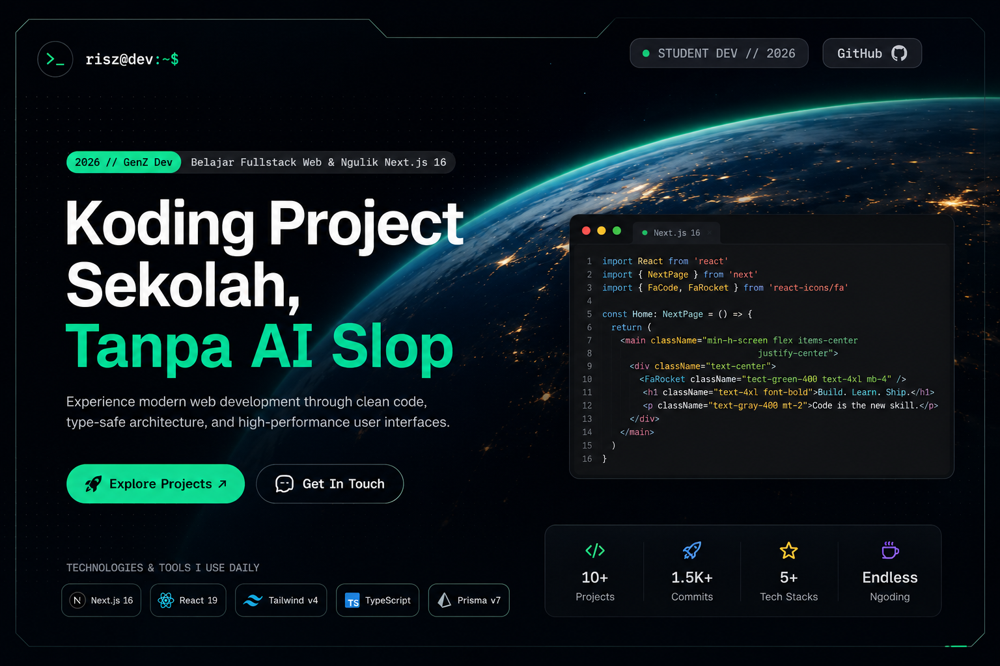
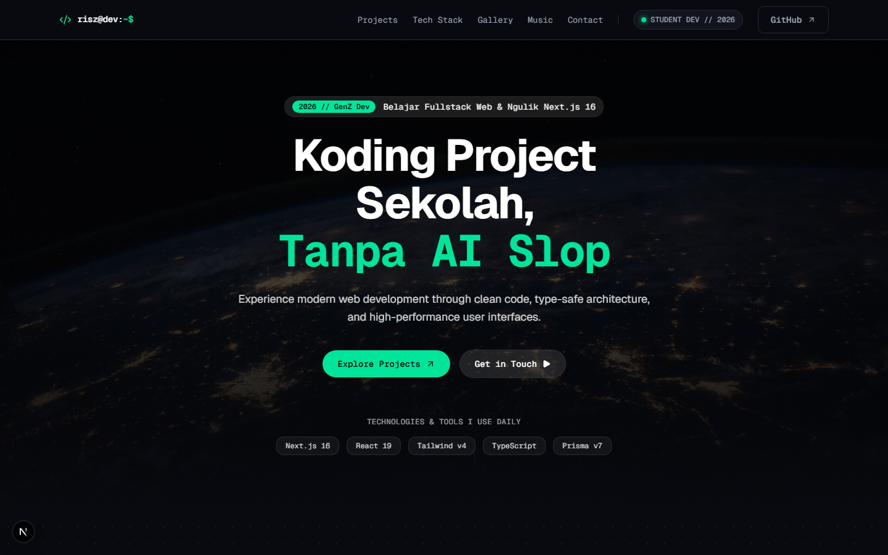

# Student Developer Portfolio

> **Anti-AI-slop modern portfolio** untuk pelajar dan developer GenZ — portfolio publik dengan dashboard admin privat berbasis Next.js 16 fullstack.



---

## ✨ Fitur

| Area | Deskripsi |
|---|---|
| 🌐 **Portfolio Publik** | Halaman beranda, daftar project, detail project, dan kontak |
| 🔒 **Dashboard Admin** | Kelola profil, skill, learning track, dan project tanpa menyentuh kode |
| 📝 **Draft & Publish** | Project draft tersembunyi dari publik sampai siap dipublikasikan |
| 🎨 **Cyber-Industrial Dark UI** | Design system Electric Emerald + Cyber Cyan di atas Dark Obsidian |
| 📱 **Responsif** | Berfungsi di 360px s/d 1440px |
| ♿ **Accessible** | Keyboard navigation, focus ring, semantic HTML, WCAG 2.2 AA |

---

## 📸 Preview

### 🏠 Landing Page



### 🗂️ Dashboard Overview


### 📱 Login Mobile


---

## 🏗️ Tech Stack

| Layer | Teknologi |
|---|---|
| **Framework** | Next.js 16 (App Router) |
| **Language** | TypeScript 5 |
| **Styling** | Tailwind CSS v4 |
| **UI Components** | shadcn/ui + Base UI |
| **Animation** | Motion |
| **Database** | Prisma v7 + SQLite (dev) / PostgreSQL (prod) |
| **Auth** | Custom session dengan cookie `httpOnly` |
| **Validation** | Zod v4 |
| **Testing** | Playwright |
| **Linting** | ESLint + commitlint + Husky |

---

## 📁 Struktur Folder

```
portfolio v1/
├── portfolio/              # Next.js fullstack app
│   ├── app/                # App Router — routes & Route Handlers
│   │   └── api/            # Route Handlers (app/api/**/route.ts)
│   ├── components/         # Reusable UI components
│   ├── server/             # Service layer, DB logic, session helpers
│   ├── lib/                # Utilities & helpers
│   ├── data/               # Template/static data (Phase 1)
│   ├── prisma/             # Prisma schema & migrations
│   │   ├── schema.prisma
│   │   └── seed.ts
│   ├── public/
│   │   └── images/         # Screenshot & aset publik
│   ├── .env.example        # Contoh environment variables
│   ├── next.config.ts
│   └── package.json
├── databases/              # SQLite dev database (diabaikan git)
├── docker-compose.yml
├── Dockerfile
└── docs/                   # Dokumentasi & PRD
```

---

## 🚀 Instalasi & Setup Lokal

### Prasyarat

- **Node.js** >= 20.x
- **npm** >= 10.x (atau pnpm / yarn)
- **Git**

### 1. Clone Repository

```bash
git clone https://github.com/<username>/portfolio-template.git
cd "portfolio-template"
```

### 2. Masuk ke Folder App

```bash
cd portfolio
```

### 3. Install Dependencies

```bash
npm install
```

### 4. Buat File Environment

```bash
cp .env.example .env
```

Edit `.env` sesuai kebutuhanmu:

```env
# Database (SQLite untuk development)
DATABASE_URL="file:../../databases/dev.db"

# Session secret — ganti dengan string acak >= 32 karakter
SESSION_SECRET="ganti-dengan-secret-yang-kuat-minimal-32-karakter"

# Kredensial owner dashboard
ADMIN_EMAIL="kamu@example.com"
ADMIN_PASSWORD="passwordKuat123!"

# Environment
NODE_ENV="development"
```

> **Penting:** Jangan commit file `.env` ke Git. Sudah ada di `.gitignore`.

### 5. Buat Folder Database

```bash
# Di root project (bukan di /portfolio)
mkdir -p ../databases
```

### 6. Jalankan Prisma Migration & Seed

```bash
# Generate Prisma client
npx prisma generate

# Jalankan migration (buat tabel database)
npx prisma migrate dev --name init

# Seed data awal (owner account + template data)
node --import tsx/esm prisma/seed.ts
```

> Setelah seed, gunakan kredensial dari `.env` (`ADMIN_EMAIL` + `ADMIN_PASSWORD`) untuk login dashboard.

### 7. Jalankan Dev Server

```bash
npm run dev
```

Buka [http://localhost:3000](http://localhost:3000) di browser.

| Route | Deskripsi |
|---|---|
| `http://localhost:3000` | Portfolio publik |
| `http://localhost:3000/login` | Login dashboard admin |
| `http://localhost:3000/dashboard` | Dashboard (butuh login) |

---

## 🐳 Menjalankan dengan Docker

### Development dengan docker-compose

```bash
# Di root project (bukan di /portfolio)
docker-compose up --build
```

App akan berjalan di [http://localhost:3000](http://localhost:3000).

### Build image manual

```bash
docker build -t student-portfolio .
docker run -p 3000:3000 \
  -e DATABASE_URL="file:/databases/dev.db" \
  -e SESSION_SECRET="secret-panjang-minimal-32-karakter" \
  -e ADMIN_EMAIL="kamu@example.com" \
  -e ADMIN_PASSWORD="passwordKuat123!" \
  -v $(pwd)/databases:/databases \
  student-portfolio
```

---

## 🧪 Testing

```bash
# Jalankan dari folder portfolio
cd portfolio

# Playwright E2E test
npx playwright test

# Playwright dengan UI browser
npx playwright test --ui
```

Screenshot hasil test disimpan di `portfolio/screenshots/`.

---

## 🔧 Scripts

Semua perintah dijalankan dari folder `portfolio/`:

| Script | Perintah | Deskripsi |
|---|---|---|
| Dev server | `npm run dev` | Jalankan development server |
| Build | `npm run build` | Build production bundle |
| Start prod | `npm run start` | Jalankan production server |
| Lint | `npm run lint` | Cek lint errors |
| Type check | `npx tsc --noEmit` | Validasi TypeScript |
| DB generate | `npx prisma generate` | Generate Prisma client |
| DB migrate | `npx prisma migrate dev` | Jalankan migration |
| DB seed | `node --import tsx/esm prisma/seed.ts` | Seed data awal |
| DB studio | `npx prisma studio` | GUI Prisma database |

---

## 🌐 Routes

### Publik

| Route | Halaman |
|---|---|
| `/` | Beranda — profil, skill, featured project, kontak |
| `/projects` | Daftar project yang published |
| `/projects/[slug]` | Detail project |
| `/contact` | Halaman kontak |

### Admin (butuh login)

| Route | Halaman |
|---|---|
| `/login` | Form login owner |
| `/dashboard` | Ringkasan status konten |
| `/dashboard/profile` | Edit profil & kontak |
| `/dashboard/skills` | Kelola grup skill & skill |
| `/dashboard/learning-tracks` | Kelola learning track |
| `/dashboard/projects` | Daftar & kelola project |
| `/dashboard/projects/new` | Buat project baru |
| `/dashboard/projects/[id]` | Edit project |

---

## 🔐 Keamanan

- Password disimpan sebagai **bcrypt hash** — tidak pernah dikirim ke browser
- Session via cookie `httpOnly`, `Secure` (production), `SameSite=Lax`
- Semua route `/dashboard/**` dan API admin diproteksi server-side
- Input divalidasi dengan **Zod** di server (Route Handler & Server Action)
- Rate limit di endpoint `/api/auth/login`
- Project berstatus `DRAFT` tidak pernah muncul di route publik

---

## 📋 Development Roadmap

| Phase | Status | Deskripsi |
|---|---|---|
| **Phase 1** — Portfolio Publik | ✅ Selesai | Halaman publik, responsivitas, accessibility |
| **Phase 1B** — Dashboard Preview | ✅ Selesai | UI dashboard statis dengan template data |
| **Phase 2** — Auth & Database | 🔜 Berikutnya | Prisma schema, session, login aktif |
| **Phase 3** — Dashboard CRUD | ⬜ Belum | API handlers, form save/publish/delete |
| **Phase 4** — Integrasi Publik | ⬜ Belum | Halaman publik baca database nyata |
| **Phase 5** — QA & Hardening | ⬜ Belum | Security audit, E2E test, deploy |

---

## 🤝 Kontribusi

Project ini adalah **portfolio template pribadi**. Fork bebas untuk kebutuhanmu sendiri.

1. Fork repository ini
2. Buat branch fitur: `git checkout -b feat/nama-fitur`
3. Commit dengan conventional commits: `git commit -m "feat: deskripsi singkat"`
4. Push dan buat Pull Request

> Commit message mengikuti [Conventional Commits](https://www.conventionalcommits.org/) — divalidasi otomatis oleh commitlint + Husky.

---

## 📄 Lisensi

MIT — bebas digunakan, dimodifikasi, dan didistribusikan.

---

<div align="center">

**Dibuat dengan Next.js 16**

</div>
