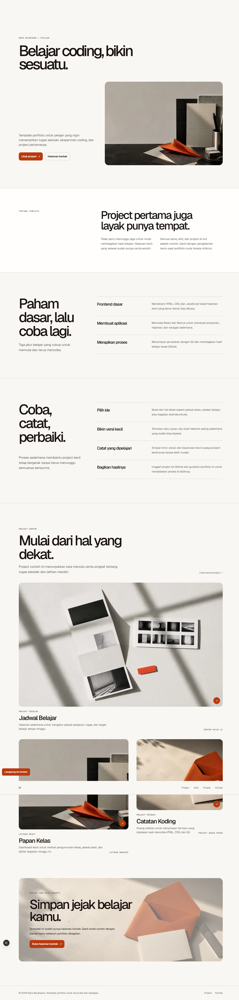
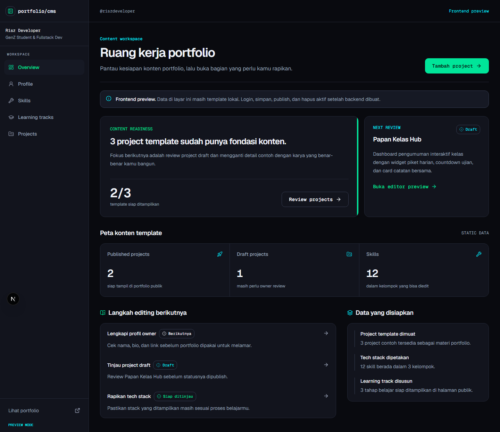
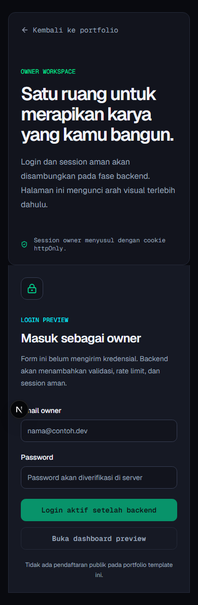
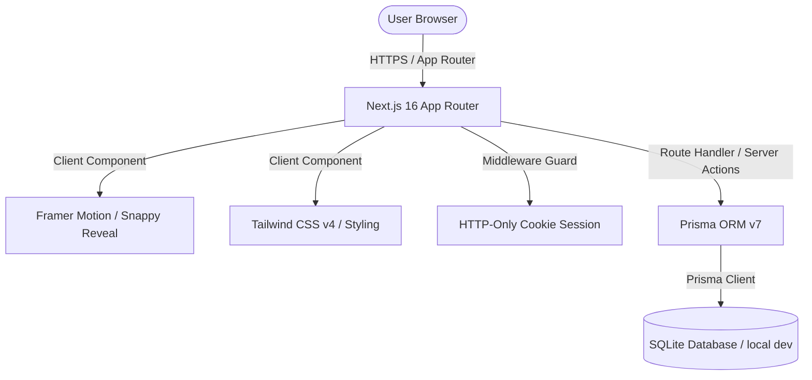
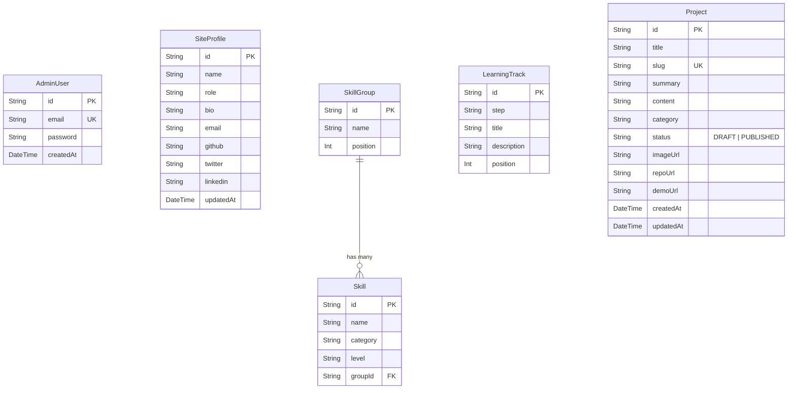

# 🎓 Student Developer Portfolio & CMS

> **Cyber-Industrial Developer Notebook** — Portofolio interaktif anti-AI-slop berbasis Next.js 16 & SQLite, dirancang khusus untuk pelajar dan developer pemula untuk mendokumentasikan rekam jejak belajar dan proyek koding mereka.

---

## 🖥️ Slide 1: Konsep & Tampilan Publik
Halaman utama dirancang dengan estetika bertema terminal cyberpunk, berfokus pada kecepatan akses, navigasi keyboard yang ramah, serta performa maksimal.

### Fitur Utama:
*   **Snappy Motion Entries**: Reveal animasi scroll (masuk/keluar viewport) yang halus dengan transisi *motion blur* sinematik menggunakan Framer Motion (`motion/react`).
*   **Scroll-Driven Progress Bar**: Indikator persentase scroll modern di bagian atas layar.
*   **Interactive CLI Playground**: Konsol terminal statis interaktif untuk menyalin command setup proyek sekolah.
*   **Bento Grid Gallery & Live Clock**: Visualisasi galeri bento responsif dan penunjuk waktu live time zone developer (WIB diformat 24 jam).


*(Tampilan Landing Page Portofolio Publik)*

---

## 📊 Slide 2: Horizon UI Dashboard (CMS)
Panel admin CMS yang didesain ulang dengan estetika **Horizon UI × Clean SaaS Admin Card Grid** untuk kemudahan manajemen konten portofolio.

### Fitur Utama:
*   **Autentikasi & Session Guard**: Sistem login aman berbasis cookie HTTP-Only terenkripsi dengan proteksi middleware `/dashboard/**`.
*   **Manajemen Konten (CRUD)**: Kelola profil, skill group, learning tracks, dan projects dari satu antarmuka yang terintegrasi.
*   **Pencarian & Notifikasi Terpadu**: Bilah pencarian global di header yang terintegrasi dengan filter katalog project, serta panel notifikasi sistem interaktif.
*   **Mode Terang & Gelap**: Tema Horizon UI adaptif sesuai preferensi pengguna.

| Desktop CMS Overview | Mobile CMS Login |
|:---:|:---:|
|  |  |

---

## 🛠️ Slide 3: Arsitektur Teknologi
Aplikasi menggunakan tumpukan teknologi modern berkinerja tinggi:



| Teknologi | Keterangan |
| :--- | :--- |
| **Next.js 16 (App Router)** | Framework React full-stack terbaru dengan performa Turbopack. |
| **Prisma ORM v7** | Object-Relational Mapper untuk manajemen skema & migrasi database. |
| **SQLite / PostgreSQL** | SQLite untuk dev lokal (portabilitas tinggi), PostgreSQL untuk produksi. |
| **Tailwind CSS v4** | CSS utility-first modern berkecepatan tinggi dengan variabel global CSS native. |
| **Framer Motion v13 (`motion`)** | Pustaka animasi kelas produksi untuk interaksi & visual web premium. |

---

## 🗄️ Slide 4: Skema Database (ERD)
Hubungan antar-model database yang dikelola oleh Prisma ORM:



---

## 🚀 Slide 5: Tutorial Install Lokal (Node.js)

Bila ingin menjalankan proyek langsung di PC lokal (memerlukan Node.js `v20+` & npm `v10+`):

1.  **Clone Repositori & Masuk Folder**:
    ```bash
    git clone <repository-url>
    cd portfolio
    ```

2.  **Instalasi Dependensi**:
    ```bash
    npm ci
    ```

3.  **Setup Environment Variables**:
    Salin file `.env.example` ke `.env`:
    ```bash
    cp .env.example .env
    ```
    Isi `.env` dengan kredensial Anda.

4.  **Inisialisasi Database & Seed**:
    Jalankan Prisma migration dan seeding data awal:
    ```bash
    npx prisma migrate dev --name init
    npx prisma db seed
    ```

5.  **Jalankan Dev Server**:
    ```bash
    npm run dev
    ```
    Aplikasi akan berjalan di `http://localhost:3000` (atau port alternatif seperti `http://localhost:3001`).

---

## 🐳 Slide 6: Tutorial Install lewat Docker (PC Lain)

Jika ingin menjalankan aplikasi di komputer lain tanpa perlu menginstal Node.js atau package lainnya secara lokal, Anda dapat menggunakan **Docker**.

### Prasyarat:
*   Sudah menginstal **Docker Desktop** atau **Docker Engine** di PC target.

### Langkah-langkah Setup:

1.  **Salin File Proyek**:
    Salin folder proyek ini (termasuk folder `portfolio/` dan `databases/` di atasnya) ke PC target.

2.  **Jalankan Docker Compose**:
    Di dalam direktori `portfolio/` (tempat file `docker-compose.yml` berada), jalankan perintah:
    ```bash
    docker compose up -d --build
    ```
    *Perintah ini akan menyusun container, menginstal dependensi, memicu Prisma generate, membangun build produksi Next.js, dan menyalakan server.*

3.  **Akses Aplikasi**:
    *   **Portofolio & CMS**: Buka browser di `http://localhost:3000`
    *   **Dashboard Admin**: Akses `http://localhost:3000/login`

4.  **Kredensial Default Login**:
    *   **Email**: `owner@example.com` (sesuai `.env` di `docker-compose.yml`)
    *   **Password**: `superpassword123`

### 💾 Persistensi Data SQLite di Docker:
Folder database lokal di-mount menggunakan volume `../databases:/databases` pada container. Kapan pun kontainer dimatikan atau diperbarui, data Anda **tidak akan hilang** karena tersimpan aman di direktori lokal komputer Anda.

---

## ⚙️ Slide 7: Panduan Operasional & Backup

### Inisialisasi Manual Database di Docker (Opsional)
Bila ingin mereset atau menjalankan migrasi secara manual di dalam container Docker:
```bash
docker compose exec portfolio npx prisma migrate deploy
docker compose exec portfolio npx prisma db seed
```

### Backup Database SQLite Lokal
Untuk mem-backup database SQLite (baik lokal maupun dalam volume Docker), salin file database di `databases/dev.db`:
```powershell
# PowerShell
Copy-Item ../databases/dev.db ../databases/dev.db.bak-$(Get-Date -Format "yyyyMMddHHmmss")
```

### Mematikan Layanan Docker
```bash
# Mematikan container tetapi tetap menjaga data database di volume
docker compose down

# Mematikan container dan menghapus seluruh volume (Hati-hati: data dev akan terhapus)
docker compose down -v
```

---

> 💻 *Proyek ini dikembangkan oleh Zagoour, Senior Next.js Fullstack Engineer.*
